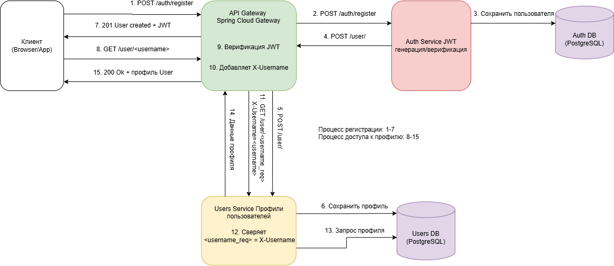

## Backend for frontends. Api gateway

### Добавить в приложение аутентификацию и регистрацию пользователей. 
Реализовать сценарий "Изменение и просмотр данных в профиле клиента".

Пользователь регистрируется. Заходит под собой и по определенному урлу получает данные о своем профиле. 
Может поменять данные в профиле. Данные профиля для чтения и редактирования не должны быть доступны другим клиентам (аутентифицированным или нет).

## Решение

### ADR-001. Выбор способа взаимодействия сервисов Авторизации и Профилей пользователя

#### Контекст
Пользователь регистрируется. При регистрации сразу создается набор прав [USER] в сервисе авторизации и профиль пользователя в сревисе профилей.

#### Варианты решения

##### [Вариант А]: Прямые синхронные HTTP-вызовы
* **Плюсы**:
    - простота реализации.
* **Минусы**:
    - Создает жесткую связность
    - Не решает проблему недоступности сервиса - задержки при ожидании ответа

##### [Вариант В]: Синхронные HTTP-вызовы через API Gateway
* **Плюсы**:
    - Простота реализации
    - Gateway может кэшировать ответы при недоступности сервиса или отдавать заглушку
    - Связность ниже, чем у прямых HTTP-Вызовов
* **Минусы**:
    - Gateway становится узким местом для всей инфраструктуры
    - Увеличивается нагрузка на Gateway

##### [Вариант С]: Асинхронная коммуникация через брокер сообщений
* **Плюсы**:
    - Полная развязка сервисов
    - Гарантированная доставка сообщений
    - Буферизация пиковых нагрузок
    - Возможность повторной обработки сообщений
* **Минусы**:
    - Профиль пользователя создается с задержкой
    - Усложнение инфраструктуры - Требует настройки и поддержки брокера сообщений (Kafka/RabbitMQ)
    - Усложнение отладки

#### Решение
Выбран **[Вариант В]** с использованием API Gateway для межсервисной коммуникации.

#### Обоснование
1. **Простота реализации**: Не требует развертывания и поддержки дополнительного брокера сообщений.
2. **Скорость разработки**: Синхронная модель проще для понимания и отладки
3. **Компромисс**: между надежностью и сложностью реализации.

#### Последствия
##### Положительные:
- Централизация настроек retry и circuit breaker в Gateway
- Упрощение мониторинга межсервисных вызовов
- Быстрое время отклика при регистрации

##### Отрицательные:
- Необходима компенсирующая транзакция - удаление пользователя из авторизации при ошибке создания профиля
- Рост зависимости от стабильности API Gateway


### ADR-002. Выбор способа верификации запросов

#### Контекст
Пользователь заходит под собой и по определенному url получает данные о своем профиле. Может поменять данные в профиле. 
Данные профиля для чтения и редактирования не должны быть доступны другим клиентам (аутентифицированным или нет).

#### Варианты решения

##### [Вариант А]: Прямой HTTP-вызов сервиса авторизации из gateway, заполнение в заголовке x-username на API Gateway на основе ответа авторизации
* **Плюсы**:
    - JWT секрет используется в одном месте
    - Gateway может кэшировать ответы при недоступности сервиса.
* **Минусы**:
    - Создает жесткую связность
    - При недоступности сервиса авторизации становится недоступен весь API
    - Создает серьезную нагрузку на сервис авторизации без кеша
    - Необходимость реализации кеша
    - Низкая безопасность проверки X-Username в остальных сервисах

##### [Вариант В]: Верификация JWT на API Gateway, заполнение в заголовке x-username на API Gateway из декодированного JWT, вместо ключей одинаковые секреты JWT.
* **Плюсы**:
    - Простота реализации
    - Gateway сам верифицирует JWT
    - Полная развязка сервисов
* **Минусы**:
    - Сложность управления секретами JWT между сервисом авторизации и gateway
    - Низкая безопасность проверки X-Username в остальных сервисах

##### [Вариант С]: использование пары ключей RSA, закрытый ключ в сервисе авторизации, открытые во всех остальных
* **Плюсы**:
    - Полная развязка сервисов
    - Каждый сервис сам верифицирует JWT запроса по открытому ключу
* **Минусы**:
    - Усложнение инфраструктуры - Требует создания пары ключей, их установки в k8s
    - Усложнение реализации


#### Решение
Выбран **[Вариант В] Верификация JWT на API Gateway**

#### Обоснование
1. **Скорость разработки**: нет необходимости в каждом сервисе реализовывать верификацию
2. **Компромисс**: простота реализации и необходимость доработки для production
3. **Быстрота внедрения**: Всего 2 сервиса (Gateway и Авторизация) работают с JWT секретом
4. **Простота поддержки**: Не нужно распределять ключи между сервисами

#### Последствия
##### Положительные:
- Быстрая реализация и простота отладки
- Быстрое время отклика при верификации
- Полная развязка сервисов

##### Отрицательные:
- Низкая безопасность проверки X-Username - в варианте В любой внутренний сервис или злоумышленник, получивший доступ к сети, может отправить запрос с X-Username. **Требуется дополнительная защита** - HMAC подпись заголовков Gateway либо другой вариант верификации в принципе
- Необходимость поддерживать консистентность секретов JWT между сервисами

### Схема взаимодействия сервисов


### Установка
Установка nginx в неймспейс zsvv-ng, kube-prometheus-stack в zsvv-monitoring, сервис авторизации в zsvv-authority, 
gateway и все остальное в zsvv-main 
```
helm repo add ingress-nginx https://kubernetes.github.io/ingress-nginx/
helm repo add prometheus-community https://prometheus-community.github.io/helm-charts
helm repo update
helm upgrade --install monitoring prometheus-community/kube-prometheus-stack -f install/monitoring/prometheus.yaml -f install/monitoring/grafana.yaml --namespace zsvv-monitoring --create-namespace
helm upgrade --install nginx ingress-nginx/ingress-nginx -f install/k8s/manifests/nginx-ingress.yaml --namespace zsvv-ng --create-namespace --set controller.admissionWebhooks.patch.enabled=true

kubectl create namespace zsvv-main
kubectl apply -f .\install\k8s\manifests\users-secret.yaml -n zsvv-main
helm upgrade --install hw6 .\install\users-service\ -n zsvv-main --set ingress.enabled=false 

kubectl create namespace zsvv-authority
kubectl apply -f .\install\k8s\manifests\auth-secrets.yaml -n zsvv-authority 
helm upgrade --install hw6 .\install\auth-service\ -n zsvv-authority --create-namespace --set endpoints.usersServiceSpace=zsvv-main --set endpoints.apiGatewaySpace=zsvv-main 

kubectl apply -f .\install\k8s\manifests\gateway-secrets.yaml -n zsvv-main
helm upgrade --install hw6-api .\install\gateway-service\ -n zsvv-main --set endpoints.usersServiceSpace=zsvv-main --set endpoints.authServiceSpace=zsvv-authority
```

Проверка
```
minikube tunnel

newman run .\.postman\HW6.postman_collection.json
```

[Postman коллекция HW6](./.postman/HW6.postman_collection.json)


Удаление
```
kubectl delete namespace zsvv-authority
kubectl delete namespace zsvv-monitoring
kubectl delete namespace zsvv-ng
kubectl delete namespace zsvv-main
```